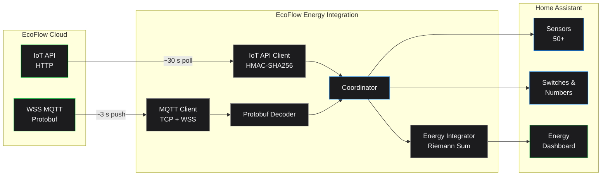

<div align="center">

# EcoFlow Energy for Home Assistant

**Real-time solar, battery, grid, and home power monitoring.**\
**Energy Dashboard ready. No portal login required.**

[](https://github.com/shuette42/ecoflow-energy-ha/actions/workflows/validate.yml)
[](https://github.com/shuette42/ecoflow-energy-ha/actions/workflows/tests.yml)
[](LICENSE)
[](https://github.com/hacs/integration)

</div>

---

## Why This Integration?

EcoFlow does not offer a local API, and repeated requests to enable Modbus access have been declined. The official Developer Portal provides only an HTTP API with ~30 s polling — too slow for meaningful real-time monitoring or automations. Getting reliable, near-real-time data from EcoFlow devices requires a different approach.

**EcoFlow Energy solves this** by establishing a persistent MQTT connection with Protobuf-encoded payloads — delivering **~3 s real-time updates** in Enhanced Mode. The key breakthrough: **this connection works independently of the EcoFlow portal.** You do not need to be logged into the EcoFlow app or portal for this integration to receive data, and it does not compete with your mobile app for a session slot.

If the connection drops for any reason, the integration automatically reconnects in the background — with a 4-tier reconnect strategy that never gives up — so data collection resumes seamlessly without any manual intervention.

**Set it up once, and it just works — reliably, around the clock.**

### How it compares

| | EcoFlow Energy | Other integrations |
|---|---|---|
| Data source | WSS MQTT, ~3 s push (Enhanced) | HTTP polling (10–30 s) or basic TCP MQTT |
| Portal login required | No — stream runs autonomously | Yes, or HTTP-only fallback |
| Reconnect | 4-tier, new ClientID, never gives up | Simple retry or gives up |
| Fallback | Automatic HTTP when MQTT is stale, transparent source routing | None |
| Stream health | 3 states: disconnected / stale / healthy | Not tracked |
| Energy tracking | Local Riemann-sum with gap detection | API totals or not available |
| Device types | Heterogeneous (Protobuf + JSON) in one integration | Single device type per project |
| Control | Switches with optimistic lock (zero-flicker) | Read-only or basic |
| Offline tolerance | Mobile devices (e.g. Delta in camper): offline = expected, no error spam | Offline = error |

---

## Features

| | |
|---|---|
| **Auto-discovery** | All devices bound to your EcoFlow account |
| **50+ sensors per device** | Power, energy, battery, temperature, diagnostics |
| **Energy Dashboard ready** | Local Riemann-sum kWh with gap detection — not API totals |
| **Switch & Number entities** | Control AC/DC output, charge speed, SoC limits — optimistic lock, zero flicker |
| **Two connection modes** | Standard (HTTP ~30 s) or Enhanced (MQTT ~3 s) |
| **Automatic fallback** | Enhanced Mode falls back to HTTP when MQTT is stale, with source routing |
| **4-tier reconnect** | Never gives up on the MQTT connection |
| **Stream health** | 3-state monitoring: disconnected / stale / healthy |
| **Offline tolerance** | Mobile devices offline = expected, not an error |
| **Multi-device** | Heterogeneous devices (Protobuf + JSON) in a single integration |
| **Diagnostics** | Built-in HA diagnostics download (no credentials exposed) |

---

## Supported Devices

### PowerOcean — Home Battery System

- 57 sensors: solar, grid, battery, home power + 6 Energy Dashboard sensors (kWh)
- 3-phase grid monitoring (voltage, current, active power per phase)
- MPPT per-string monitoring (2 strings: power, voltage, current)
- Battery diagnostics (SoH, cycles, cell temps, cell voltages, MOSFET temps)
- EMS state (work mode, feed mode, grid status, power factor)
- **Standard Mode**: HTTP polling ~30 s | **Enhanced Mode**: WSS real-time ~3 s

### Delta 2 Max — Portable Power Station

- 58 sensors: battery SoC/SoH, all input/output power, temperatures, voltages
- 5 binary sensors: AC enabled, DC output, 12V, UPS mode, X-Boost
- 3 switches: **AC output on/off**, **DC output on/off**, **12V output on/off**
- 4 number controls: AC charge speed (200–2400 W), max/min SoC limits, standby timeout
- Standard Mode only (HTTP polling ~30 s)

### Smart Plug

- 9 sensors: power (W), current (A), voltage (V), frequency, temperature
- 1 binary sensor: relay state
- 1 switch: **plug on/off** — ideal for automations (e.g. charge Delta when surplus)
- Standard Mode only (HTTP polling ~30 s)

> Other EcoFlow Delta-series devices (Delta Pro, Delta 2, etc.) should work automatically with the Delta sensor set.

---

## Installation

### HACS (recommended)

1. Open **HACS** in Home Assistant
2. Click **Integrations** > **+ Explore & Download Repositories**
3. Search for **EcoFlow Energy**
4. Click **Download**
5. Restart Home Assistant

### Manual

1. Download the latest release from [Releases](https://github.com/shuette42/ecoflow-energy-ha/releases)
2. Copy `custom_components/ecoflow_energy/` to your HA `config/custom_components/`
3. Restart Home Assistant

---

## Configuration

### Prerequisites

1. An [EcoFlow app](https://www.ecoflow.com) account with devices bound
2. Access Key + Secret Key from the [EcoFlow Developer Portal](https://developer.ecoflow.com)

### Setup

1. Go to **Settings > Devices & Services > Add Integration**
2. Search for **EcoFlow Energy**
3. Enter your **Access Key** and **Secret Key**
4. Select the devices you want to add
5. Choose connection mode:
   - **Standard** (default) — official API, recommended
   - **Enhanced** — requires EcoFlow email + password (see below)
6. Done — entities appear automatically

### Standard vs Enhanced Mode

| | Standard | Enhanced |
|---|---|---|
| API | Official IoT Developer API | Unofficial WSS bridge |
| Update rate | ~30 seconds (HTTP polling) | ~3 seconds (MQTT push) |
| Credentials | Access Key + Secret Key | + Email + Password |
| Stability | Stable (official) | May break with EcoFlow updates |
| Best for | Most users | Power users needing real-time data |

**Enhanced Mode** uses reverse-engineered WebSocket connections to the EcoFlow portal. It is not officially supported and may stop working if EcoFlow changes their portal. A disclaimer is shown during setup.

### Options Flow

After initial setup, you can change settings via **Settings > Devices & Services > EcoFlow Energy > Configure**:

- Switch between Standard and Enhanced mode
- Add or remove devices

---

## Energy Dashboard Setup

All energy sensors use `state_class: total_increasing` and are automatically available in the HA Energy Dashboard. Go to **Settings > Dashboards > Energy** to configure:

<details>
<summary><strong>Grid</strong></summary>

| Setting | Sensor |
|---|---|
| Grid consumption (import) | **Grid Import Energy** (kWh) |
| Return to grid (export) | **Grid Export Energy** (kWh) |
| Power measurement type | **Standard** |
| Power measurement | **Grid Power** (W) |

</details>

<details>
<summary><strong>Solar</strong></summary>

| Setting | Sensor |
|---|---|
| Solar production energy | **Solar Energy** (kWh) |
| Solar production power | **Solar Power** (W) |

</details>

<details>
<summary><strong>Battery</strong></summary>

| Setting | Sensor |
|---|---|
| Energy charged into battery | **Battery Charge Energy** (kWh) |
| Energy discharged from battery | **Battery Discharge Energy** (kWh) |
| Power measurement type | **Two sensors** |
| Discharge power | **Battery Discharge Power** (W) |
| Charge power | **Battery Charge Power** (W) |

> **Tip:** Select "Two sensors" for battery power — this gives HA both charge and discharge flow separately, which is more accurate than a single signed sensor.

</details>

<details>
<summary><strong>Home Consumption</strong></summary>

Home energy is calculated automatically by HA from the other sources. You can optionally add:

| Setting | Sensor |
|---|---|
| Home energy | **Home Energy** (kWh) |
| Home power | **Home Power** (W) |

</details>

After saving, the Energy Dashboard shows real-time solar production, grid import/export, battery charge/discharge, and home consumption — all from your EcoFlow system.

---

## Use Cases & Automations

<details>
<summary><strong>Smart Plug: Charge Delta when PowerOcean is full</strong></summary>

```yaml
automation:
  - alias: "Charge Delta 2 Max when PowerOcean battery is full"
    trigger:
      - platform: numeric_state
        entity_id: sensor.ecoflow_powerocean_battery_soc
        above: 98
    condition:
      - condition: numeric_state
        entity_id: sensor.ecoflow_delta_2_max_soc
        below: 80
    action:
      - service: switch.turn_on
        target:
          entity_id: switch.ecoflow_smart_plug_plug

  - alias: "Stop charging Delta when full or PowerOcean drops"
    trigger:
      - platform: numeric_state
        entity_id: sensor.ecoflow_delta_2_max_soc
        above: 99
      - platform: numeric_state
        entity_id: sensor.ecoflow_powerocean_battery_soc
        below: 50
    action:
      - service: switch.turn_off
        target:
          entity_id: switch.ecoflow_smart_plug_plug
```

</details>

<details>
<summary><strong>Delta 2 Max: Control AC output remotely</strong></summary>

```yaml
automation:
  - alias: "Delta AC off at night"
    trigger:
      - platform: time
        at: "23:00:00"
    action:
      - service: switch.turn_off
        target:
          entity_id: switch.ecoflow_delta_2_max_ac_output
```

</details>

<details>
<summary><strong>Solar surplus alerts</strong></summary>

```yaml
automation:
  - alias: "Grid export alert — use surplus"
    trigger:
      - platform: numeric_state
        entity_id: sensor.ecoflow_powerocean_grid_export_power
        above: 1000
        for: "00:05:00"
    action:
      - service: notify.mobile_app
        data:
          title: "Solar surplus"
          message: >
            Exporting {{ states('sensor.ecoflow_powerocean_grid_export_power') }}W
            — consider turning on high-load devices
```

</details>

---

## Entity Types

| Platform | PowerOcean | Delta 2 Max | Smart Plug |
|----------|-----------|-------------|------------|
| Sensor | 57 (power, energy, battery, grid, MPPT) | 58 (power, voltage, temp, SoC) | 9 (power, voltage, current, temp) |
| Binary Sensor | — | 5 (AC, DC, 12V, UPS, X-Boost) | 1 (relay state) |
| Switch | — | 3 (AC, DC, 12V output) | 1 (plug on/off) |
| Number | — | 4 (charge speed, SoC limits, standby) | — |

---

## Troubleshooting

<details>
<summary><strong>No entities appearing</strong></summary>

- Check that your devices are online in the EcoFlow app
- Verify your Access Key and Secret Key in the Developer Portal
- Check **Settings > System > Logs** for `ecoflow_energy` errors

</details>

<details>
<summary><strong>Data not updating</strong></summary>

- **Standard Mode**: Data updates via HTTP polling every ~30 s. Check your Access Key and Secret Key if no data appears.
- **Enhanced Mode**: If the WSS connection drops, it automatically reconnects with a new ClientID. Check logs for reconnect messages.

</details>

<details>
<summary><strong>Enhanced Mode not working</strong></summary>

- Verify your EcoFlow app email and password are correct
- Enhanced Mode requires the `cryptography` package (included in HA Core)
- Check logs for "Enhanced login failed" or "decryption failed" errors

</details>

<details>
<summary><strong>Diagnostics</strong></summary>

Download diagnostics via **Settings > Devices & Services > EcoFlow Energy > 3-dot menu > Download Diagnostics**. This includes connection status and data freshness — no credentials are included.

</details>

---

## Architecture



### File Structure

```
custom_components/ecoflow_energy/
├── __init__.py              # Entry setup, reload listener
├── coordinator.py           # Per-device coordinator (HTTP polling + MQTT push)
├── config_flow.py           # Setup + Options flow
├── sensor.py                # Sensor platform (RestoreSensor)
├── switch.py / number.py    # Control entities (Delta only)
├── binary_sensor.py         # Binary sensors (Delta, Smart Plug)
├── const.py                 # Sensor/entity definitions per device type
├── ecoflow/
│   ├── iot_api.py           # IoT Developer API client (HMAC-SHA256 signed)
│   ├── cloud_http.py        # HTTP quota polling client
│   ├── cloud_mqtt.py        # MQTT client (TCP + WSS)
│   ├── enhanced_auth.py     # Enhanced Mode login + AES decryption
│   ├── energy_integrator.py # Riemann-sum energy tracking
│   ├── energy_stream.py     # Protobuf payload builders
│   ├── clientid.py          # WSS ClientID generation (MD5 hash)
│   ├── const.py             # API endpoints and constants
│   ├── parsers/             # Per-device HTTP/MQTT response parsers
│   └── proto/               # Protobuf decoder (Enhanced Mode)
```

---

## License

MIT — see [LICENSE](LICENSE)

## Contributing

Issues and pull requests welcome on [GitHub](https://github.com/shuette42/ecoflow-energy-ha).

---

<div align="center">

Made by [huette.ai](https://huette.ai) — digital systems, built to hold.

[](https://www.buymeacoffee.com/shuette)

</div>
